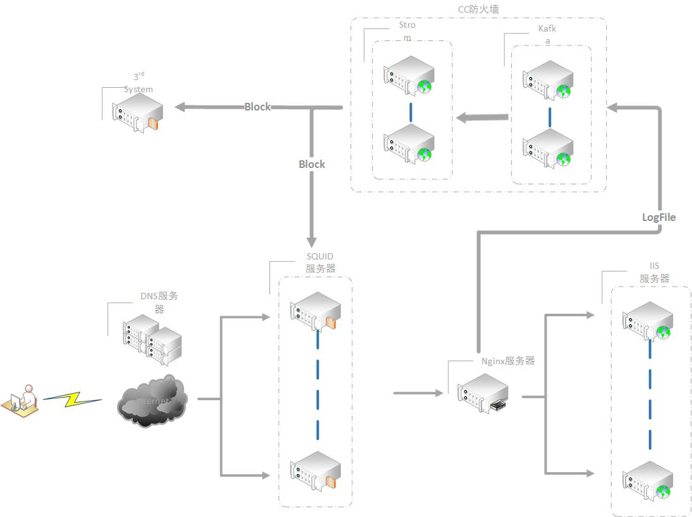
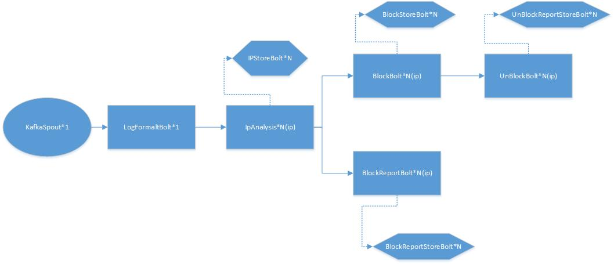
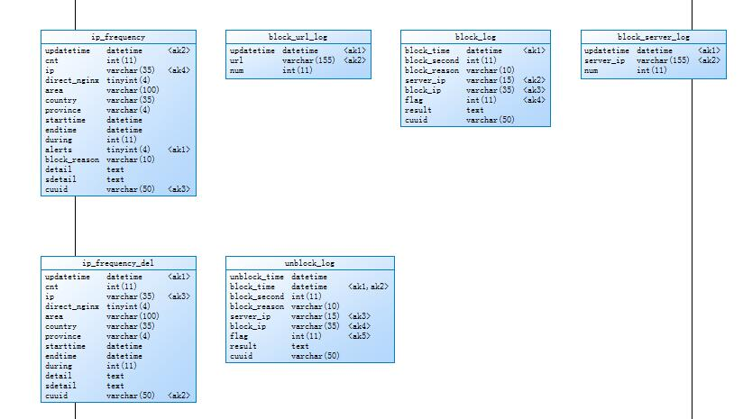

# CC防火墙 #

## 简介 ##
CC防火墙的架构采用Flume+Kafka+Strom+Zookeeper+Mysql实现,实现异常IP的及时封停功能

## 组件 ##
- **Flume**      :部署在所有的Nginx服务器上，将Nginx日志推送至Kafka中，
- **Kafka**      : 临时存储Nginx的log数据
- **Strom**     ：从Kafka取数据并进行数据分析
- **Zookeeper** ：存储CC防火墙的配置文件，并且所有部署在Squid上的客户端也注册在这个Zookeeper上。
- **Agent**     ：部署在每台Squid上，并且信息注册到Zookeeper的临时节点上，接收到封停指令后通过iptables封锁IP。

## Strom拓扑 ##

- **KafkaSpOut**：进行Kafka数据的读取，这里为了方便与简单，并且保证顺序性Kafka内只是用一个Partion。
- **LogFormatBolt** : 收到KafkaSpout读取出的Nginx日志后进行格式化处理，并在此使用纯真库进行IP GEO匹配
- **IpAnalysis** ： 几乎所有的逻辑都在这里实现，如IP的计数器，报警的匹配等等，为了可以动态调整防火墙的配置，配置文件保存在Zookeeper中，也是在这里Watch Zookeeper的节点，达到动态改变配置的。
- **BlockBolt** ： 接收到IpAnalysis 发送的信息后，将异常的信息通过Thrift发送给各个Squid机器。
- **UnBlockBolt** ： 接收到BlockBolt成功封锁后的IP后经过一段时间进行解封。
- **BlockReportBlot** ： 做数据统计用的，对整体的作用不大
- **xStoreBolt** ： 数据库存储Bolt，拓扑上的IPStoreBolt，BlockStoreBolt，BlockReportStoreBolt 都是使用的这一个Bolt。

## Thrit封存解封接口 ##

    service CCfirewall{
    	string  blockipbyiptables(1:string mkey,2: string ip)
    	string  unblockipbyiptables(1:string mkey,2: string ip)
	}

## Zookeeper目录 ##

**目录树**

    .
    └─ccfirewall
       ├─config                           //存储防火墙配置信息
       └─agent_list                       //存储Agent列表
       		└─iptables                       		//使用iptables封锁的站点
				├─10.0.0.1
				├─10.0.0.1
				├─...
			

**config配置**

	{
	    "count": "50",                            //IP计数个数
	    "if_block": "true",                        //是否开启封停
	    "if_warning": "false",                    //是否开启警告
	    "threshold_w_secound": "10",            //警告阈值秒数
	    "threshold_secound": "20",                //封停阈值秒数
	    "block_second": "864000",                //封停秒数
	    "ip_white_list": [                        //IP白名单
	        "127.0.0.1",
	        "211.103.231.10"
	    ],
	    "url_list": [{                            //URL黑名单
	        "url": "all",                        //全部
	        "type": "normal"                    //normal (精确) 或 after (向后模糊)
	    }],
	    "special_rule": {                        //特殊规则
	        "reg.gyyx.cn/Login/Async": {        //URL
	            "threshold_w_secound": "100",    //警告阈值秒数
	            "threshold_secound": "300",        //封停阈值秒数
	            "block_second": "86400"            //封停秒数
	        }
	    }
	}

## 数据库模型 ##

## Agent ##
**启动Agent** 

	python CCFirewall.py 本机IP

## 前端 ##

[http://ccfirewall.gyyx.cn](http://ccfirewall.gyyx.cn "CC防火墙管理端")

左上方可以设置防火前的配置，保存后实时生效，中上方可以查看当前已经上线的客户端，点击详情可以看到此客户端已经封停的IP格式，右上方可以看到曲线，地图，已经两个计数器信息

左下方显示最新的达到计数器的条目，右下方可以看到异常IP在客户端的封锁状况。
